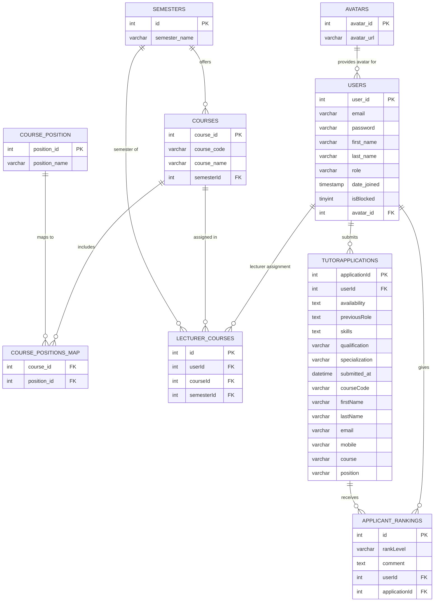

```mermaid
erDiagram
    AVATARS {
        int avatar_id PK
        varchar avatar_url
    }
    USERS {
        int user_id PK
        varchar email
        varchar password
        varchar first_name
        varchar last_name
        varchar role
        timestamp date_joined
        tinyint isBlocked
        int avatar_id FK
    }
    SEMESTERS {
        int id PK
        varchar semester_name
    }
    COURSES {
        int course_id PK
        varchar course_code
        varchar course_name
        int semesterId FK
    }
    COURSE_POSITION {
        int position_id PK
        varchar position_name
    }
    COURSE_POSITIONS_MAP {
        int course_id FK
        int position_id FK
    }
    LECTURER_COURSES {
        int id PK
        int userId FK
        int courseId FK
        int semesterId FK
    }
    TUTORAPPLICATIONS {
        int applicationId PK
        int userId FK
        text availability
        text previousRole
        text skills
        varchar qualification
        varchar specialization
        datetime submitted_at
        varchar courseCode
        varchar firstName
        varchar lastName
        varchar email
        varchar mobile
        varchar course
        varchar position
    }
    APPLICANT_RANKINGS {
        int id PK
        varchar rankLevel
        text comment
        int userId FK
        int applicationId FK
    }

    %% relationships
    AVATARS              ||--o{ USERS                   : "provides avatar for"
    USERS                ||--o{ LECTURER_COURSES        : "lecturer assignment"
    COURSES              ||--o{ LECTURER_COURSES        : "assigned in"
    SEMESTERS            ||--o{ LECTURER_COURSES        : "semester of"
    SEMESTERS            ||--o{ COURSES                 : "offers"
    USERS                ||--o{ TUTORAPPLICATIONS       : "submits"
    USERS                ||--o{ APPLICANT_RANKINGS      : "gives"
    TUTORAPPLICATIONS    ||--o{ APPLICANT_RANKINGS      : "receives"
    COURSES              ||--o{ COURSE_POSITIONS_MAP    : "includes"
    COURSE_POSITION      ||--o{ COURSE_POSITIONS_MAP    : "maps to"
```
